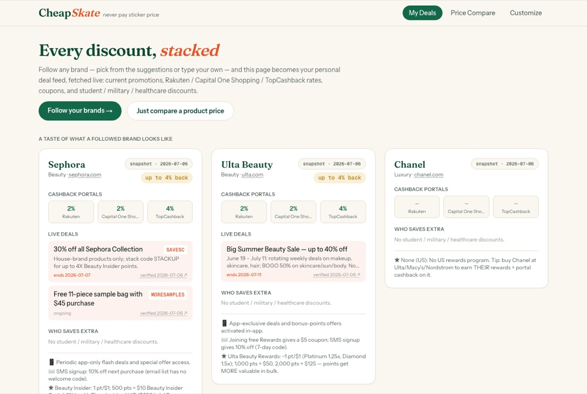

# CheapSkate — what a product actually costs once the discounts stack

A personal deal-stacking app: pick your favorite brands once, then see — in one
place — every current promotion, cashback-portal rate, official coupon,
student/military/healthcare discount, and what your own credit cards add on
top. Or just search any product and find out where it's *actually* cheapest
after everything stacks.



*The deal feed — brands, promotions and card offers stacked*

## Features

- **My Deals** (`/`) — your customized feed, **fetched live**. Follow any
  brand (type it in — not limited to a preset list); when you open the page,
  each brand is looked up on the web right then via Claude + web search:
  current promos with codes and end dates, Rakuten / Capital One Shopping /
  TopCashback rates, identity discounts (with verifier: SheerID, ID.me,
  UNiDAYS), app-exclusive offers, loyalty programs, email/SMS signup offers.
  Results are cached for a few hours (`BRAND_CACHE_TTL_HOURS`, default 6) and
  every card shows its freshness — `live · just now`, `cached · 2h ago` — with
  a ↻ button to force a re-fetch. Without an `ANTHROPIC_API_KEY`, the app
  falls back to the dated research snapshot and says so on each card.
- **Price Compare** (`/compare`) — search a product, compare retailers by
  **true net cost**: sticker price → coupon / identity discount → portal
  cashback → your card's rewards. Shows which of your cards wins, plus
  merchant credits that could apply (e.g. Amex Platinum's $75/quarter
  Lululemon credit) and a reminder to check targeted issuer offers
  (Chase Offers / Amex Offers / Capital One Offers).
- **Customize** (`/settings`) — pick brands, credit cards, and the discount
  groups you qualify for. Stored in localStorage (no account needed).
- **Live web search** — with `ANTHROPIC_API_KEY` set, `/api/live` uses Claude
  (`claude-opus-4-8`) with the server-side web-search tool to fetch current
  prices for any product across retailers in real time, and links results back
  to the tracked stores so cashback stacking still applies.

## Data sources

Seed data was verified on **2026-07-06** directly against portal pages and
dated press sources — every rate carries a `sourceUrl` and a
`verified/approximate` confidence flag. Facts encoded in the seed data:

- Chanel participates in **no** cashback portal and never discounts.
- Rakuten currently pays **8% on Nike** (elevated); TopCashback pays **10%**.
- TopCashback pays **7% at Macy's** (recently boosted) and **6% at Alo Yoga**.
- Amex Platinum's **Saks credit ended 2026-07-01**; its **$75/quarter
  Lululemon credit** (added Sept 2025) is active.
- Nordstrom Anniversary Sale 2026 preview opened **July 6**; public access
  July 18 – Aug 9.
- Issuer offer programs are targeted per account — the app surfaces them as
  "check your app" hints, never as guaranteed math.

## Run

```bash
npm install
cp .env.local.example .env.local   # optional: add ANTHROPIC_API_KEY for live search
npm run dev                        # http://localhost:3000
```

## Stack

Next.js 16 (App Router) · React 19 · Tailwind v4 · TypeScript ·
`@anthropic-ai/sdk` (web search server tool) · localStorage profiles.
